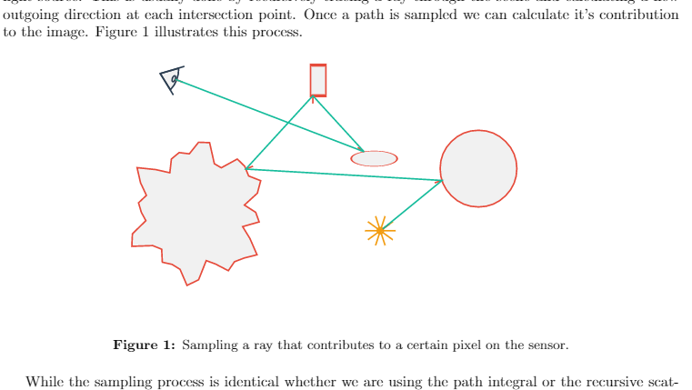
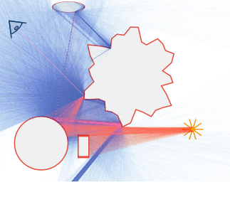
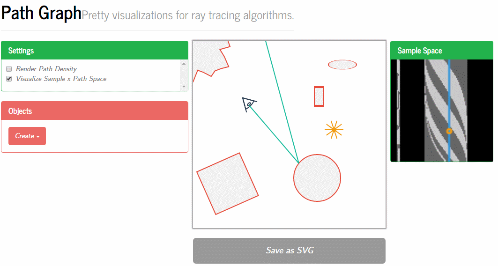

# Path Graph
Pretty visualizations for ray tracing algorithms
-------------
Hosted at [darioseyb.com](https://darioseyb.com/pathgraph)

This project was born out of my frustation with making figures that illustrate processes in ray/path tracing algorithm. Particularly in the context of my seminar report about ["Gradient Domain Path Tracing"](https://darioseyb.com/report/gdpt.html) creating figures by hand was not feasible.

Path Graph gives you a flexible framework to visualize all kinds of situations. You can write your scattering functions directly in the browser and see the results immediatly. It also provides various visualization modes and SVG export functionality. This way you can put final touches on your figures in your favourite vector graphics editing tool. As shown below you can then easily embed the SVG files in your LaTex report.

Visualization includes a "path density" renderer which shows the distributions of paths starting at the camera. You can color the paths based on certain attributes, e.g. if they hit a light or not.

Path Graph also provides a primary samples space visualizer which draws the scene from the perspective of the light source.

 

I plan on developing this tool further and include support for features like scriptable material models. If you have a feature request please open an issue!
